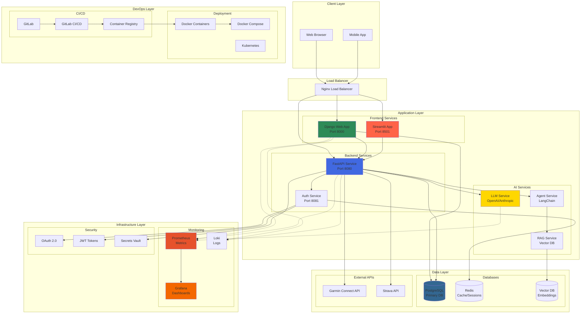

# Architecture Technique - Coach IA

## Schéma d'Architecture Technique

## Technologies et Versions

### Frontend
- **Django 4.2+**: Interface web principale, génération guidée de plans
- **Streamlit 1.28+**: Interface conversationnelle avec l'IA
- **HTML5/CSS3/JavaScript**: Technologies web standards

### Backend
- **FastAPI 0.104+**: API REST principale, haute performance
- **Python 3.11+**: Langage principal du backend
- **Pydantic**: Validation et sérialisation des données
- **SQLAlchemy**: ORM pour la base de données

### Intelligence Artificielle
- **OpenAI GPT-4**: Modèle de langage principal
- **LangChain**: Framework pour les agents IA et RAG
- **ChromaDB**: Base de données vectorielle pour les embeddings
- **Sentence Transformers**: Génération d'embeddings

### Base de Données
- **PostgreSQL 15+**: Base de données principale
- **Redis 7+**: Cache et gestion des sessions
- **pgvector**: Extension PostgreSQL pour les vecteurs

### Infrastructure
- **Docker & Docker Compose**: Conteneurisation
- **Nginx**: Reverse proxy et load balancer
- **Prometheus**: Collecte de métriques
- **Grafana**: Visualisation et dashboards
- **Loki**: Agrégation de logs

### Sécurité
- **OAuth 2.0**: Authentification avec Garmin/Strava
- **JWT**: Tokens d'authentification
- **HTTPS/TLS**: Chiffrement des communications
- **HashiCorp Vault**: Gestion des secrets

### DevOps
- **GitLab CI/CD**: Pipeline d'intégration continue
- **Docker Registry**: Stockage des images
- **Kubernetes**: Orchestration (production)

## Contraintes Techniques

### Performance
- Temps de réponse API < 500ms (95e percentile)
- Temps de génération IA < 10s
- Support de 100 utilisateurs simultanés

### Sécurité
- Conformité RGPD
- Chiffrement des données sensibles
- Audit trail complet
- Rate limiting sur les APIs

### Disponibilité
- SLA 99.5% de disponibilité
- Sauvegarde quotidienne automatique
- Plan de reprise d'activité < 4h

### Scalabilité
- Architecture microservices
- Scaling horizontal des services
- Cache distribué avec Redis
- CDN pour les assets statiques