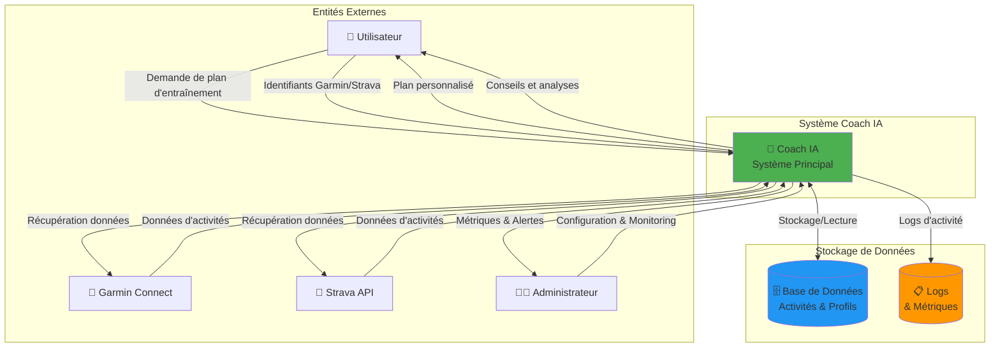
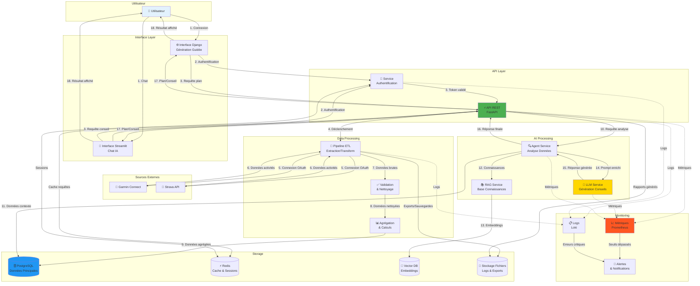

# Diagramme de Flux de Données - Coach IA

## Diagramme de Flux de Données (DFD) - Niveau 0



## Diagramme de Flux de Données - Niveau 1 (Détaillé)



## Flux de Données Détaillés

### 1. Flux d'Authentification
```
Utilisateur → Interface → Service Auth → Base Utilisateurs → Token JWT → Cache Redis
```

### 2. Flux de Récupération Données
```
Trigger → Pipeline ETL → APIs Externes → Validation → Transformation → Base PostgreSQL
```

### 3. Flux de Génération IA
```
Requête → Agent → Context DB → RAG → LLM → Réponse → Interface → Utilisateur
```

### 4. Flux de Monitoring
```
Services → Métriques → Prometheus → Grafana → Alertes → Notifications
```

## Types de Données

### Données d'Entrée
- **Profil utilisateur**: âge, poids, niveau, objectifs
- **Données Garmin**: activités, FC, GPS, cadence
- **Données Strava**: segments, efforts, social
- **Paramètres**: préférences d'entraînement

### Données de Traitement
- **Métriques calculées**: VMA, seuils, charge d'entraînement
- **Données agrégées**: moyennes, tendances, progressions
- **Context IA**: historique, profil enrichi

### Données de Sortie
- **Plans d'entraînement**: séances structurées
- **Conseils personnalisés**: recommandations
- **Analyses**: rapports de performance
- **Métriques système**: logs, performances

## Sécurité des Flux

### Chiffrement
- TLS 1.3 pour toutes les communications
- Chiffrement des données sensibles en base
- Tokens JWT avec expiration

### Conformité RGPD
- Consentement explicite pour récupération données
- Suppression automatique données temporaires
- Anonymisation des logs
- Droit à l'effacement respecté