# Diagramme de Flux de Données - Coach IA

## Diagramme de Flux de Données (DFD) - Niveau 0

```mermaid
graph TD
    subgraph "Entités Externes"
        USER[👤 Utilisateur]
        GARMIN[🏃 Garmin Connect]
        STRAVA[🚴 Strava API]
        ADMIN[👨‍💼 Administrateur]
    end

    subgraph "Système Coach IA"
        SYSTEM[🤖 Coach IA<br/>Système Principal]
    end

    subgraph "Stockage de Données"
        DB[(🗄️ Base de Données<br/>Activités & Profils)]
        LOGS[(📋 Logs<br/>& Métriques)]
    end

    %% Flux principaux
    USER -->|Demande de plan d'entraînement| SYSTEM
    USER -->|Identifiants Garmin/Strava| SYSTEM
    SYSTEM -->|Plan personnalisé| USER
    SYSTEM -->|Conseils et analyses| USER
    
    SYSTEM -->|Récupération données| GARMIN
    GARMIN -->|Données d'activités| SYSTEM
    
    SYSTEM -->|Récupération données| STRAVA
    STRAVA -->|Données d'activités| SYSTEM
    
    SYSTEM <-->|Stockage/Lecture| DB
    SYSTEM -->|Logs d'activité| LOGS
    
    ADMIN -->|Configuration & Monitoring| SYSTEM
    SYSTEM -->|Métriques & Alertes| ADMIN

    style SYSTEM fill:#4CAF50
    style DB fill:#2196F3
    style LOGS fill:#FF9800
```



## Diagramme de Flux de Données - Niveau 1 (Détaillé)

```mermaid
graph TD
    subgraph "Utilisateur"
        USER[👤 Utilisateur]
    end

    subgraph "Sources Externes"
        GARMIN[🏃 Garmin Connect]
        STRAVA[🚴 Strava API]
    end

    subgraph "Interface Layer"
        DJANGO[🌐 Interface Django<br/>Génération Guidée]
        STREAMLIT[💬 Interface Streamlit<br/>Chat IA]
    end

    subgraph "API Layer"
        AUTH[🔐 Service<br/>Authentification]
        API[⚡ API REST<br/>FastAPI]
    end

    subgraph "AI Processing"
        LLM[🧠 LLM Service<br/>Génération Conseils]
        AGENT[🔍 Agent Service<br/>Analyse Données]
        RAG[📚 RAG Service<br/>Base Connaissances]
    end

    subgraph "Data Processing"
        ETL[🔄 Pipeline ETL<br/>Extraction/Transform]
        VALID[✅ Validation<br/>& Nettoyage]
        AGGR[📊 Agrégation<br/>& Calculs]
    end

    subgraph "Storage"
        POSTGRES[(🗄️ PostgreSQL<br/>Données Principales)]
        REDIS[(⚡ Redis<br/>Cache & Sessions)]
        VECTOR[(🔢 Vector DB<br/>Embeddings)]
        FILES[(📁 Stockage Fichiers<br/>Logs & Exports)]
    end

    subgraph "Monitoring"
        METRICS[📈 Métriques<br/>Prometheus]
        LOGS[📋 Logs<br/>Loki]
        ALERTS[🚨 Alertes<br/>& Notifications]
    end

    %% Flux utilisateur
    USER -->|1. Connexion| DJANGO
    USER -->|1. Chat| STREAMLIT
    
    DJANGO -->|2. Authentification| AUTH
    STREAMLIT -->|2. Authentification| AUTH
    
    AUTH -->|3. Token validé| API
    DJANGO -->|3. Requête plan| API
    STREAMLIT -->|3. Requête conseil| API
    
    %% Flux de récupération de données
    API -->|4. Déclenchement| ETL
    ETL -->|5. Connexion OAuth| GARMIN
    ETL -->|5. Connexion OAuth| STRAVA
    
    GARMIN -->|6. Données activités| ETL
    STRAVA -->|6. Données activités| ETL
    
    ETL -->|7. Données brutes| VALID
    VALID -->|8. Données nettoyées| AGGR
    AGGR -->|9. Données agrégées| POSTGRES
    
    %% Flux de traitement IA
    API -->|10. Requête analyse| AGENT
    AGENT -->|11. Données contexte| POSTGRES
    AGENT -->|12. Connaissances| RAG
    RAG -->|13. Embeddings| VECTOR
    
    AGENT -->|14. Prompt enrichi| LLM
    LLM -->|15. Réponse générée| AGENT
    AGENT -->|16. Réponse finale| API
    
    API -->|17. Plan/Conseil| DJANGO
    API -->|17. Plan/Conseil| STREAMLIT
    
    DJANGO -->|18. Résultat affiché| USER
    STREAMLIT -->|18. Résultat affiché| USER
    
    %% Flux de cache
    API <-->|Cache requêtes| REDIS
    AUTH <-->|Sessions| REDIS
    
    %% Flux de monitoring
    API -.->|Métriques| METRICS
    LLM -.->|Métriques| METRICS
    AGENT -.->|Métriques| METRICS
    
    API -.->|Logs| LOGS
    ETL -.->|Logs| LOGS
    AUTH -.->|Logs| LOGS
    
    METRICS -->|Seuils dépassés| ALERTS
    LOGS -->|Erreurs critiques| ALERTS
    
    %% Stockage fichiers
    ETL -->|Exports/Sauvegardes| FILES
    API -->|Rapports générés| FILES

    style USER fill:#E3F2FD
    style API fill:#4CAF50
    style LLM fill:#FFD700
    style POSTGRES fill:#2196F3
    style METRICS fill:#FF5722
```



## Flux de Données Détaillés

### 1. Flux d'Authentification
```
Utilisateur → Interface → Service Auth → Base Utilisateurs → Token JWT → Cache Redis
```

### 2. Flux de Récupération Données
```
Trigger → Pipeline ETL → APIs Externes → Validation → Transformation → Base PostgreSQL
```

### 3. Flux de Génération IA
```
Requête → Agent → Context DB → RAG → LLM → Réponse → Interface → Utilisateur
```

### 4. Flux de Monitoring
```
Services → Métriques → Prometheus → Grafana → Alertes → Notifications
```

## Types de Données

### Données d'Entrée
- **Profil utilisateur**: âge, poids, niveau, objectifs
- **Données Garmin**: activités, FC, GPS, cadence
- **Données Strava**: segments, efforts, social
- **Paramètres**: préférences d'entraînement

### Données de Traitement
- **Métriques calculées**: VMA, seuils, charge d'entraînement
- **Données agrégées**: moyennes, tendances, progressions
- **Context IA**: historique, profil enrichi

### Données de Sortie
- **Plans d'entraînement**: séances structurées
- **Conseils personnalisés**: recommandations
- **Analyses**: rapports de performance
- **Métriques système**: logs, performances

## Sécurité des Flux

### Chiffrement
- TLS 1.3 pour toutes les communications
- Chiffrement des données sensibles en base
- Tokens JWT avec expiration

### Conformité RGPD
- Consentement explicite pour récupération données
- Suppression automatique données temporaires
- Anonymisation des logs
- Droit à l'effacement respecté