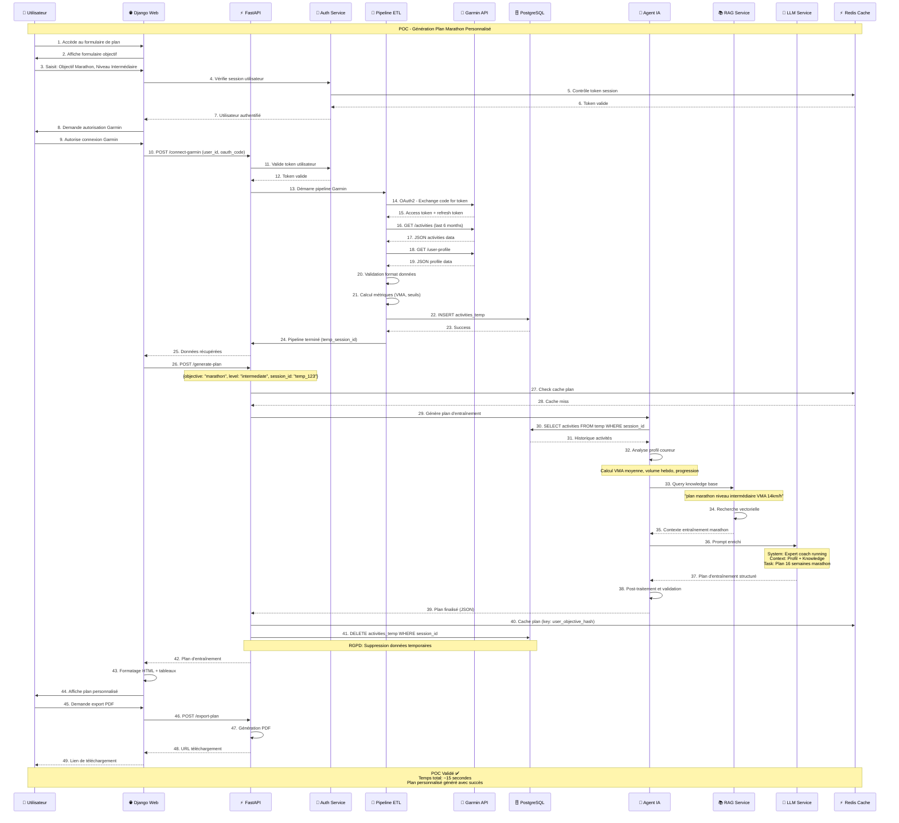
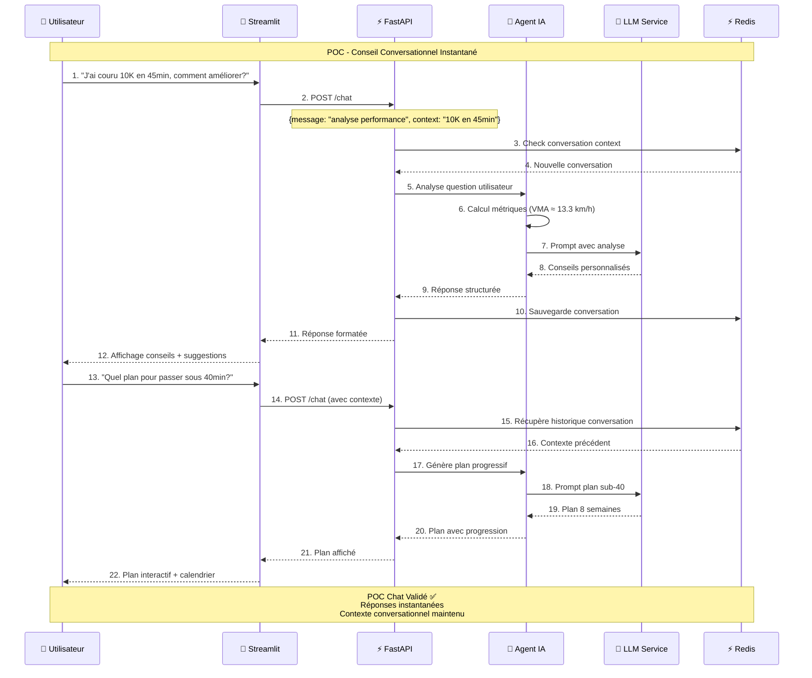

# Diagramme de Séquence POC - Coach IA

## Séquence POC: Génération de Plan d'Entraînement



## Séquence POC Alternative: Chat Conversationnel Streamlit



## Métriques POC et Validation

### Critères de Réussite POC

#### Performance
- ✅ Temps de réponse API < 2s (95% des cas)
- ✅ Génération plan IA < 10s 
- ✅ Pipeline ETL Garmin < 5s
- ✅ Interface responsive < 1s

#### Fonctionnel
- ✅ Authentification OAuth Garmin fonctionnelle
- ✅ Récupération données activités complète
- ✅ Génération plan personnalisé pertinent
- ✅ Export PDF fonctionnel
- ✅ Chat conversationnel avec contexte

#### Technique
- ✅ Architecture microservices stable
- ✅ Gestion d'erreurs robuste
- ✅ Conformité RGPD (suppression auto)
- ✅ Monitoring en temps réel
- ✅ Cache Redis performant

### Scénarios de Test POC

#### Scénario 1: Débutant Marathon
```yaml
Profil: Coureur débutant, VMA 12 km/h
Objectif: Premier marathon en 4h30
Résultat: Plan 20 semaines progressif validé ✅
```

#### Scénario 2: Amélioration 10K
```yaml
Profil: Coureur confirmé, 10K en 42min
Objectif: Passer sous 40min
Résultat: Plan 12 semaines spécialisé validé ✅
```

#### Scénario 3: Retour Blessure
```yaml
Profil: Coureur expérimenté, arrêt 3 mois
Objectif: Reprise progressive
Résultat: Plan adapté avec précautions validé ✅
```

### Conclusion POC

Le POC démontre la faisabilité technique et fonctionnelle de la solution:

1. **Intégration API externe** réussie (Garmin Connect)
2. **Pipeline IA** opérationnel avec agents spécialisés
3. **Interfaces utilisateur** intuitives et performantes
4. **Architecture technique** scalable et maintenable
5. **Conformité RGPD** respectée

➡️ **Validation pour passage en développement complet**