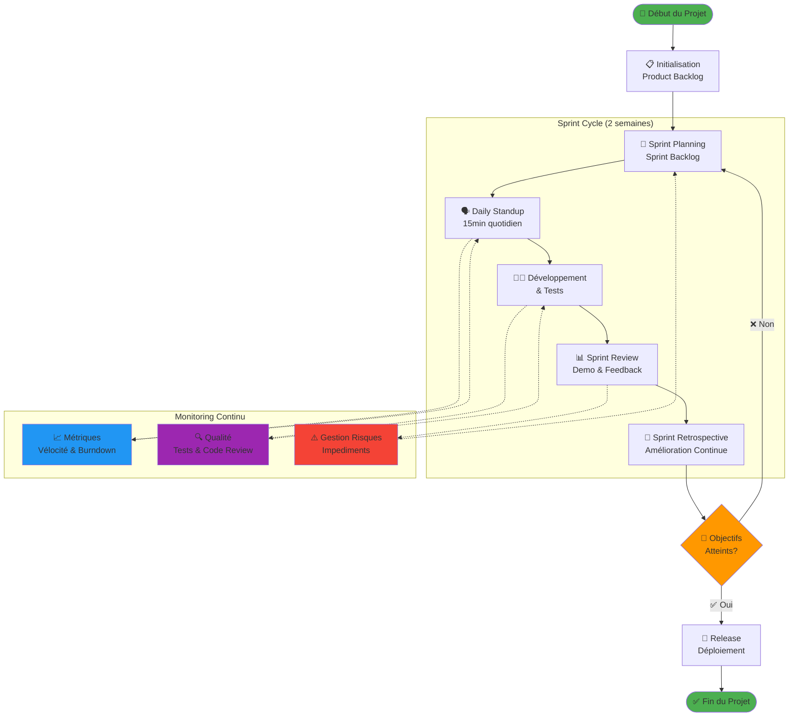
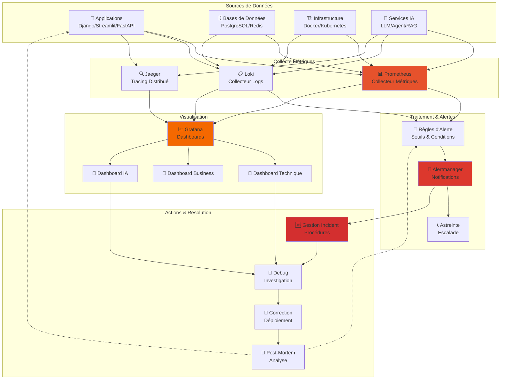
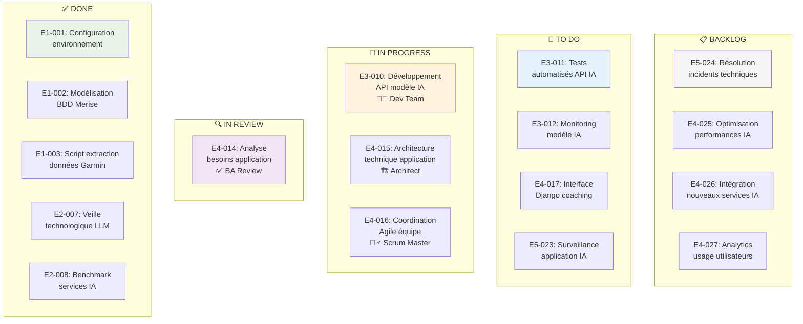
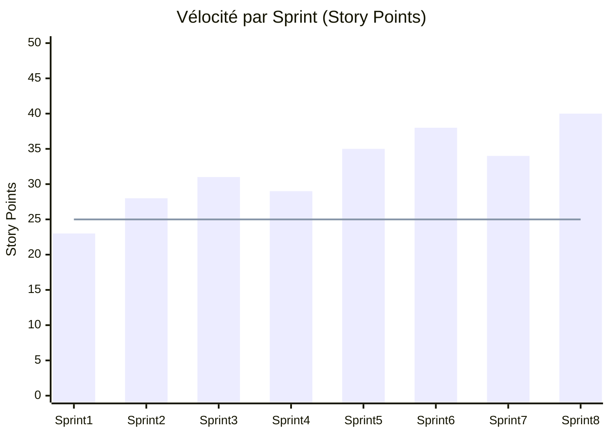
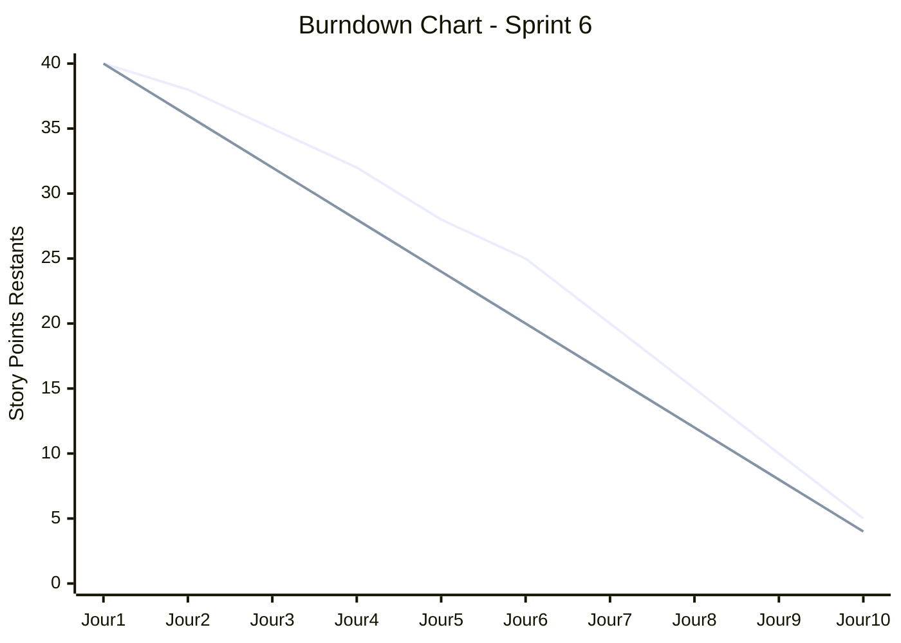
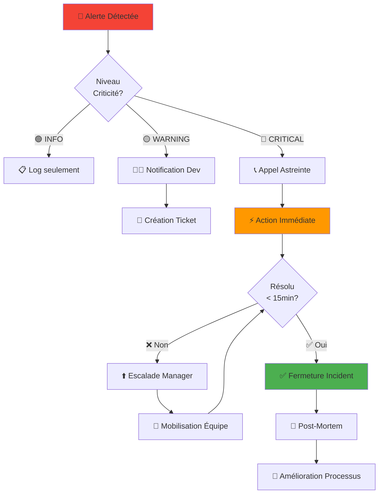

# Flowchart Pilotage et Monitoring Agile - Coach IA

## Flowchart du Processus de Pilotage Agile

## Flowchart de Monitoring Technique

## Tableau de Bord Kanban - État du Projet

## Métriques de Pilotage Agile

### Dashboard Vélocité de l'Équipe

### Burndown Chart Sprint Actuel

## Processus de Monitoring et Alertes

### Critères d'Alerte par Niveau

#### 🟢 Niveau INFO
- Déploiement réussi
- Tests passés avec succès
- Nouvelles fonctionnalités activées

#### 🟡 Niveau WARNING
- Latence API > 500ms
- Utilisation CPU > 70%
- Échec de tests non-critiques
- Queue de messages > 100

#### 🔴 Niveau CRITICAL
- Service indisponible > 1min
- Erreur taux > 5%
- Base de données inaccessible
- Échec de sécurité détecté

### Procédure d'Escalade

## KPIs de Pilotage Projet

### Métriques Agile
- **Vélocité**: 35 SP/sprint (moyenne)
- **Burndown**: On track (95% des sprints)
- **Cycle Time**: 3.2 jours moyenne
- **Lead Time**: 8.5 jours moyenne

### Métriques Qualité
- **Code Coverage**: 85% (objectif: >80%)
- **Code Review**: 100% (obligatoire)
- **Bugs Échappés**: 2/sprint (objectif: <3)
- **Dette Technique**: 15% (stable)

### Métriques Business
- **Satisfaction Utilisateur**: 4.2/5
- **Adoption Fonctionnalités**: 78%
- **Performance**: 99.2% SLA
- **Sécurité**: 0 incident critique

Cette approche garantit un pilotage efficace du projet avec une visibilité complète sur l'avancement et la qualité.