# Flowchart Pilotage et Monitoring Agile - Coach IA

## Flowchart du Processus de Pilotage Agile

```mermaid
flowchart TD
    START([🚀 Début du Projet]) --> INIT[📋 Initialisation<br/>Product Backlog]
    
    INIT --> PLANNING[📅 Sprint Planning<br/>Sprint Backlog]
    
    subgraph "Sprint Cycle (2 semaines)"
        PLANNING --> DAILY[🗣️ Daily Standup<br/>15min quotidien]
        DAILY --> DEV[👨‍💻 Développement<br/>& Tests]
        DEV --> REVIEW[📊 Sprint Review<br/>Demo & Feedback]
        REVIEW --> RETRO[🔄 Sprint Retrospective<br/>Amélioration Continue]
    end
    
    RETRO --> DECISION{🎯 Objectifs<br/>Atteints?}
    DECISION -->|✅ Oui| RELEASE[🚀 Release<br/>Déploiement]
    DECISION -->|❌ Non| PLANNING
    
    RELEASE --> END([✅ Fin du Projet])
    
    %% Monitoring en parallèle
    subgraph "Monitoring Continu"
        METRICS[📈 Métriques<br/>Vélocité & Burndown]
        QUALITY[🔍 Qualité<br/>Tests & Code Review]
        RISKS[⚠️ Gestion Risques<br/>Impediments]
    end
    
    DAILY -.-> METRICS
    DEV -.-> QUALITY
    REVIEW -.-> RISKS
    
    %% Feedback loops
    METRICS -.-> DAILY
    QUALITY -.-> DEV
    RISKS -.-> PLANNING

    style START fill:#4CAF50
    style END fill:#4CAF50
    style DECISION fill:#FF9800
    style METRICS fill:#2196F3
    style QUALITY fill:#9C27B0
    style RISKS fill:#F44336
```

## Flowchart de Monitoring Technique

```mermaid
flowchart TD
    subgraph "Sources de Données"
        APP[📱 Applications<br/>Django/Streamlit/FastAPI]
        DB[🗄️ Bases de Données<br/>PostgreSQL/Redis]
        INFRA[🏗️ Infrastructure<br/>Docker/Kubernetes]
        AI[🤖 Services IA<br/>LLM/Agent/RAG]
    end
    
    subgraph "Collecte Métriques"
        PROM[📊 Prometheus<br/>Collecteur Métriques]
        LOKI[📋 Loki<br/>Collecteur Logs]
        JAEGER[🔍 Jaeger<br/>Tracing Distribué]
    end
    
    subgraph "Traitement & Alertes"
        RULES[📏 Règles d'Alerte<br/>Seuils & Conditions]
        ALERT[🚨 Alertmanager<br/>Notifications]
        ONCALL[📞 Astreinte<br/>Escalade]
    end
    
    subgraph "Visualisation"
        GRAF[📈 Grafana<br/>Dashboards]
        DASH_TECH[🔧 Dashboard Technique]
        DASH_BIZ[💼 Dashboard Business]
        DASH_AI[🧠 Dashboard IA]
    end
    
    subgraph "Actions & Résolution"
        INCIDENT[🆘 Gestion Incident<br/>Procédures]
        DEBUG[🐛 Debug<br/>Investigation]
        FIX[🔧 Correction<br/>Déploiement]
        POSTMORT[📝 Post-Mortem<br/>Analyse]
    end
    
    %% Flux de données
    APP --> PROM
    DB --> PROM
    INFRA --> PROM
    AI --> PROM
    
    APP --> LOKI
    DB --> LOKI
    INFRA --> LOKI
    AI --> LOKI
    
    APP --> JAEGER
    AI --> JAEGER
    
    %% Traitement
    PROM --> RULES
    LOKI --> RULES
    RULES --> ALERT
    ALERT --> ONCALL
    
    %% Visualisation
    PROM --> GRAF
    LOKI --> GRAF
    JAEGER --> GRAF
    
    GRAF --> DASH_TECH
    GRAF --> DASH_BIZ
    GRAF --> DASH_AI
    
    %% Actions
    ALERT --> INCIDENT
    DASH_TECH --> DEBUG
    DASH_AI --> DEBUG
    
    INCIDENT --> DEBUG
    DEBUG --> FIX
    FIX --> POSTMORT
    
    %% Feedback
    POSTMORT -.-> RULES
    POSTMORT -.-> APP

    style PROM fill:#E6522C
    style GRAF fill:#F46800
    style ALERT fill:#DC382D
    style INCIDENT fill:#D32F2F
```

## Tableau de Bord Kanban - État du Projet

```mermaid
graph TB
    subgraph "📋 BACKLOG"
        B1[E5-024: Résolution<br/>incidents techniques]
        B2[E4-025: Optimisation<br/>performances IA]
        B3[E4-026: Intégration<br/>nouveaux services IA]
        B4[E4-027: Analytics<br/>usage utilisateurs]
    end
    
    subgraph "🎯 TO DO"
        T1[E3-011: Tests<br/>automatisés API IA]
        T2[E3-012: Monitoring<br/>modèle IA]
        T3[E4-017: Interface<br/>Django coaching]
        T4[E5-023: Surveillance<br/>application IA]
    end
    
    subgraph "🔄 IN PROGRESS"
        I1[E3-010: Développement<br/>API modèle IA<br/>👨‍💻 Dev Team]
        I2[E4-015: Architecture<br/>technique application<br/>🏗️ Architect]
        I3[E4-016: Coordination<br/>Agile équipe<br/>🏃‍♂️ Scrum Master]
    end
    
    subgraph "🔍 IN REVIEW"
        R1[E4-014: Analyse<br/>besoins application<br/>✅ BA Review]
    end
    
    subgraph "✅ DONE"
        D1[E1-001: Configuration<br/>environnement]
        D2[E1-002: Modélisation<br/>BDD Merise]
        D3[E1-003: Script extraction<br/>données Garmin]
        D4[E2-007: Veille<br/>technologique LLM]
        D5[E2-008: Benchmark<br/>services IA]
    end

    style B1 fill:#F5F5F5
    style T1 fill:#E3F2FD
    style I1 fill:#FFF3E0
    style R1 fill:#F3E5F5
    style D1 fill:#E8F5E8
```

## Métriques de Pilotage Agile

### Dashboard Vélocité de l'Équipe

```mermaid
xychart-beta
    title "Vélocité par Sprint (Story Points)"
    x-axis [Sprint1, Sprint2, Sprint3, Sprint4, Sprint5, Sprint6, Sprint7, Sprint8]
    y-axis "Story Points" 0 --> 50
    bar [23, 28, 31, 29, 35, 38, 34, 40]
    line [25, 25, 25, 25, 25, 25, 25, 25]
```

### Burndown Chart Sprint Actuel

## Processus de Monitoring et Alertes

### Critères d'Alerte par Niveau

#### 🟢 Niveau INFO
- Déploiement réussi
- Tests passés avec succès
- Nouvelles fonctionnalités activées

#### 🟡 Niveau WARNING
- Latence API > 500ms
- Utilisation CPU > 70%
- Échec de tests non-critiques
- Queue de messages > 100

#### 🔴 Niveau CRITICAL
- Service indisponible > 1min
- Erreur taux > 5%
- Base de données inaccessible
- Échec de sécurité détecté

### Procédure d'Escalade

```mermaid
graph TD
    ALERT[🚨 Alerte Détectée] --> LEVEL{Niveau<br/>Criticité?}
    
    LEVEL -->|🟢 INFO| LOG[📋 Log seulement]
    LEVEL -->|🟡 WARNING| DEV[👨‍💻 Notification Dev]
    LEVEL -->|🔴 CRITICAL| ONCALL[📞 Appel Astreinte]
    
    DEV --> TICKET[🎫 Création Ticket]
    ONCALL --> IMMEDIATE[⚡ Action Immédiate]
    
    IMMEDIATE --> RESOLVE{Résolu<br/>< 15min?}
    RESOLVE -->|✅ Oui| CLOSE[✅ Fermeture Incident]
    RESOLVE -->|❌ Non| ESCALATE[⬆️ Escalade Manager]
    
    ESCALATE --> TEAM[👥 Mobilisation Équipe]
    TEAM --> RESOLVE
    
    CLOSE --> POSTMORT[📝 Post-Mortem]
    POSTMORT --> IMPROVE[🔄 Amélioration Processus]

    style ALERT fill:#F44336
    style IMMEDIATE fill:#FF9800
    style CLOSE fill:#4CAF50
```

## KPIs de Pilotage Projet

### Métriques Agile
- **Vélocité**: 35 SP/sprint (moyenne)
- **Burndown**: On track (95% des sprints)
- **Cycle Time**: 3.2 jours moyenne
- **Lead Time**: 8.5 jours moyenne

### Métriques Qualité
- **Code Coverage**: 85% (objectif: >80%)
- **Code Review**: 100% (obligatoire)
- **Bugs Échappés**: 2/sprint (objectif: <3)
- **Dette Technique**: 15% (stable)

### Métriques Business
- **Satisfaction Utilisateur**: 4.2/5
- **Adoption Fonctionnalités**: 78%
- **Performance**: 99.2% SLA
- **Sécurité**: 0 incident critique

Cette approche garantit un pilotage efficace du projet avec une visibilité complète sur l'avancement et la qualité.