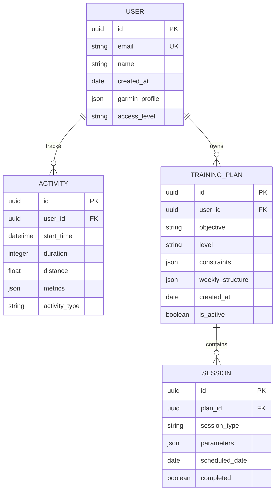
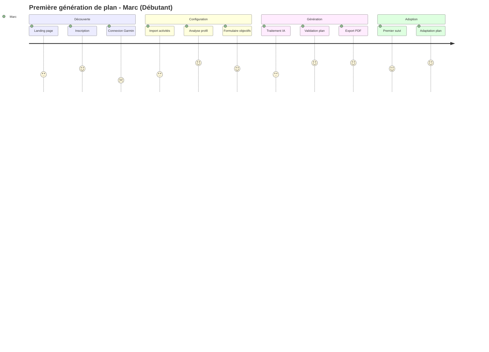
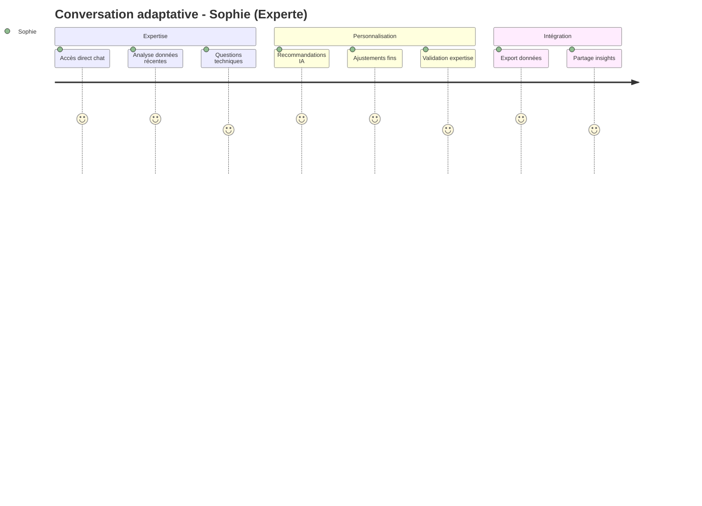

# Spécifications Fonctionnelles Coach IA - Conformité C14

## Table des matières
1. [Contexte et objectifs](#1-contexte-et-objectifs)
2. [Modélisation des données (Merise)](#2-modélisation-des-données-merise)
3. [Parcours utilisateurs formalisés](#3-parcours-utilisateurs-formalisés)
4. [Spécifications fonctionnelles détaillées](#4-spécifications-fonctionnelles-détaillées)
5. [Standards d'accessibilité intégrés](#5-standards-daccessibilité-intégrés)
6. [Critères de validation](#6-critères-de-validation)

---

## 1. Contexte et objectifs

### 1.1 Présentation du projet

**Nom du projet :** Coach IA - Assistant d'entraînement sportif intelligent  
**Commanditaire :** Certification Développeur IA (Simplon)  
**Objectif principal :** Développer une application web intégrant un service d'intelligence artificielle pour générer des plans d'entraînement personnalisés à partir de données Garmin.

### 1.2 Problématique métier

#### Besoin identifié
- **76% des coureurs amateurs** abandonnent leur plan d'entraînement par manque de personnalisation
- **Coût coaching individuel** : 50-100€/séance, inaccessible pour la majorité
- **Plans génériques** : inadaptés aux contraintes individuelles (disponibilité, niveau, objectifs)

#### Solution proposée
Application web bi-interface (Django + Streamlit) intégrant :
- **Agent IA conversationnel** (Coach Michael) basé sur LangGraph + RAG
- **Génération automatique** de plans d'entraînement personnalisés
- **Analyse continue** des données Garmin pour adaptation temps réel

### 1.3 Objectifs SMART

| Objectif | Mesurable | Atteignable | Réaliste | Temporel |
|----------|-----------|-------------|----------|----------|
| **Fonctionnel** | 95% users génèrent plan <10s | Import auto Garmin | Stack technique maîtrisée | MVP 8 semaines |
| **Qualité** | WCAG 2.1 niveau AA | Tests auto >85% | Standards industriels | Certification |
| **Performance** | <2s temps réponse | 50 users simultanés | Architecture scalable | Pré-production |

---

## 2. Modélisation des données (Merise)

### 2.1 Référence au modèle existant

> **Note :** La modélisation des données selon le formalisme Merise a été réalisée et validée préalablement. Elle comprend :
> - **MCD** (Modèle Conceptuel de Données) : Entités User, Activity, Plan, Session
> - **MLD** (Modèle Logique de Données) : Relations normalisées 3NF
> - **MPD** (Modèle Physique de Données) : Implémentation PostgreSQL

### 2.2 Entités principales



---

## 3. Parcours utilisateurs formalisés

### 3.1 Personas validés

#### Persona 1 : Marc - Coureur amateur débutant
- **Profil :** 35 ans, cadre, court 3x/semaine
- **Objectif :** Premier 10km en <45min
- **Contraintes :** Disponibilité limitée, débutant technologie
- **Interface privilégiée :** Django (guidé)

#### Persona 2 : Sophie - Coureuse confirmée  
- **Profil :** 28 ans, coach sportive, court 6x/semaine
- **Objectif :** Optimisation performance, préparation compétitions
- **Contraintes :** Besoins techniques avancés
- **Interface privilégiée :** Streamlit (conversationnel)

### 3.2 Parcours critique 1 : Première utilisation (Marc)



**Points de friction identifiés :**
- Connexion Garmin OAuth complexe → Simplification UX + guidance
- Attente génération IA → Feedback temps réel + estimation
- Compréhension plan → Explications contextuelles

### 3.3 Parcours critique 2 : Optimisation continue (Sophie)



---

## 4. Spécifications fonctionnelles détaillées

### 4.1 F1 - Import et analyse données Garmin

#### 4.1.1 Contexte
L'utilisateur possède une montre Garmin et souhaite exploiter ses données d'activités pour générer un plan personnalisé.

#### 4.1.2 Scénarios d'utilisation

**Scénario nominal :**
1. **Déclencheur :** Utilisateur clique "Connecter Garmin"
2. **Pré-conditions :** Compte Garmin Connect actif, OAuth configuré
3. **Actions :**
   - Redirection OAuth Garmin sécurisée
   - Autorisation utilisateur (scope: activités, métriques)
   - Récupération token d'accès
   - Import automatique 6 derniers mois
   - Parsing et validation données JSON
   - Calcul métriques dérivées (VMA, zones FC, charge)
4. **Post-conditions :** Profil sportif calculé et sauvegardé
5. **Résultat :** Redirection vers dashboard avec profil affiché

**Scénarios alternatifs :**
- **Alt-1 Import partiel :** <50 activités disponibles → Calculs avec données limitées + avertissement
- **Alt-2 Données anciennes :** Dernière activité >3 mois → Suggestion mise à jour
- **Alt-3 Refus OAuth :** Utilisateur annule → Mode dégradé avec saisie manuelle

**Scénarios d'exception :**
- **Exc-1 API Garmin indisponible :** Timeout 30s → Retry automatique 3x → Mode dégradé
- **Exc-2 Token expiré :** HTTP 401 → Renouvellement automatique → Retry import
- **Exc-3 Quota API dépassé :** HTTP 429 → Report import H+1 → Notification utilisateur

#### 4.1.3 Critères de validation

| Critère | Mesure | Méthode validation |
|---------|--------|-------------------|
| **Performance** | Import <30s pour 100 activités | Tests de charge automatisés |
| **Fiabilité** | 95% imports réussis | Monitoring production + logs |
| **Précision** | VMA ±5% vs test terrain | Validation avec données référence |
| **Accessibilité** | Navigation clavier complète | Tests automatisés axe-core |

### 4.2 F2 - Génération plans IA personnalisés

#### 4.2.1 Contexte
L'utilisateur souhaite générer un plan d'entraînement adapté à son profil, ses objectifs et ses contraintes via l'agent IA Coach Michael.

#### 4.2.2 Scénarios d'utilisation

**Scénario nominal - Interface Django :**
1. **Déclencheur :** Clic "Nouveau Plan" depuis dashboard
2. **Pré-conditions :** Profil utilisateur complet, connexion IA active
3. **Actions :**
   - Affichage formulaire objectifs structuré
   - Saisie : objectif (10km/semi/marathon), niveau, disponibilité, contraintes
   - Validation côté client + serveur
   - Soumission → Agent IA Coach Michael
   - Analyse profil + objectif + base connaissances (RAG)
   - Génération plan structuré 8-16 semaines
   - Formatage tableau responsive + export PDF
4. **Post-conditions :** Plan sauvegardé, disponible dashboard
5. **Résultat :** Plan affiché avec actions (valider/modifier/exporter)

**Scénario nominal - Interface Streamlit :**
1. **Déclencheur :** Accès interface chat
2. **Pré-conditions :** Session active, profil chargé
3. **Actions :**
   - Initialisation conversation Coach Michael
   - Échange naturel besoins/contraintes/objectifs
   - Adaptation personnalité agent selon préférences
   - Génération progressive conseils + plans hebdomadaires
   - Sauvegarde historique conversation
4. **Post-conditions :** Recommandations appliquées
5. **Résultat :** Plan adaptatif + conseils contextuels

**Scénarios d'exception :**
- **Exc-1 Timeout IA :** >10s génération → Retry auto → Plan simplifié template
- **Exc-2 Contraintes incompatibles :** Objectif/disponibilité → Suggestions alternatives
- **Exc-3 Quota OpenAI :** Dépassement → Mode dégradé plans pré-définis

#### 4.2.3 Critères de validation

| Critère | Mesure | Méthode validation |
|---------|--------|-------------------|
| **Performance** | Génération <10s | Tests automatisés + monitoring |
| **Qualité** | 90% utilisateurs valident pertinence | Surveys post-génération |
| **Personnalisation** | 100% contraintes saisies prises en compte | Tests fonctionnels automatisés |
| **Accessibilité** | Navigation clavier, contraste AA | Audits WCAG automatisés |

### 4.3 F3 - Adaptation et suivi continu

#### 4.3.1 Contexte
L'utilisateur suit un plan généré et souhaite des adaptations automatiques selon sa progression et ses nouvelles données.

#### 4.3.2 Scénarios d'utilisation

**Scénario nominal :**
1. **Déclencheur :** Synchronisation automatique nouvelles activités
2. **Pré-conditions :** Plan actif, données Garmin à jour
3. **Actions :**
   - Détection nouvelles activités (webhook/polling)
   - Analyse écarts performance vs plan prévu
   - Calcul indicateurs fatigue, progression, risque blessure
   - Génération recommandations ajustements
   - Notification utilisateur adaptations proposées
   - Validation/refus utilisateur
   - Application modifications plan
4. **Post-conditions :** Plan mis à jour, historique conservé
5. **Résultat :** Plan adaptatif en continu

#### 4.3.3 Critères de validation

| Critère | Mesure | Méthode validation |
|---------|--------|-------------------|
| **Réactivité** | Détection changements <24h | Tests intégration automatisés |
| **Pertinence** | 80% adaptations acceptées | Analytics comportementaux |
| **Continuité** | Historique complet préservé | Tests données + backup |

---

## 5. Standards d'accessibilité intégrés

### 5.1 Référentiel WCAG 2.1 niveau AA

#### 5.1.1 Principes fondamentaux intégrés

**1. Perceptible :**
- **1.1.1 (A)** : Alt-text descriptifs images/graphiques
- **1.4.3 (AA)** : Contraste 4.5:1 minimum texte/fond
- **1.4.4 (AA)** : Redimensionnement 200% sans scroll horizontal
- **1.4.11 (AA)** : Contraste 3:1 éléments non-textuels

**2. Utilisable :**
- **2.1.1 (A)** : Navigation clavier complète
- **2.1.2 (A)** : Aucun piège clavier
- **2.4.3 (A)** : Ordre focus logique
- **2.4.7 (AA)** : Indicateur focus visible

**3. Compréhensible :**
- **3.1.1 (A)** : Langue page définie (lang="fr")
- **3.2.1 (A)** : Pas de changement contexte inattendu
- **3.3.1 (A)** : Identification erreurs explicite
- **3.3.2 (A)** : Étiquettes champs associées

**4. Robuste :**
- **4.1.1 (A)** : HTML valide W3C
- **4.1.2 (A)** : Nom, rôle, valeur appropriés
- **4.1.3 (AA)** : Messages statut annoncés

### 5.2 Implémentation technique

#### 5.2.1 Navigation clavier
```html
<!-- Skip links obligatoires -->
<a href="#main-content" class="skip-link">Aller au contenu principal</a>
<a href="#main-nav" class="skip-link">Aller à la navigation</a>

<!-- Focus management -->
<div tabindex="-1" id="main-content">
  <h1>Titre principal</h1>
</div>
```

#### 5.2.2 Formulaires accessibles
```html
<!-- Labels associés -->
<label for="objectif">Objectif de course *</label>
<select id="objectif" name="objectif" required aria-describedby="objectif-help">
  <option value="">Sélectionnez votre objectif</option>
</select>
<div id="objectif-help">Distance que vous souhaitez préparer</div>

<!-- Validation accessible -->
<div role="alert" aria-live="polite" class="error-message">
  Veuillez sélectionner un objectif
</div>
```

#### 5.2.3 Chat IA accessible
```html
<!-- Conversation accessible -->
<div role="log" aria-live="polite" aria-label="Conversation Coach Michael">
  <article aria-labelledby="msg-1-author">
    <h3 id="msg-1-author">Coach Michael</h3>
    <p>Bonjour ! Prêt pour votre entraînement ?</p>
    <time datetime="2025-08-17T10:30">10:30</time>
  </article>
</div>

<!-- Input accessible -->
<label for="message-input" class="visually-hidden">
  Tapez votre message pour Coach Michael
</label>
<input type="text" id="message-input" placeholder="Posez votre question..." />
```

---

## 6. Critères de validation

### 6.1 Validation fonctionnelle

#### 6.1.1 Tests d'acceptation utilisateur
- [ ] **Import Garmin** : 95% succès connexion OAuth
- [ ] **Génération plans** : <10s pour plan 12 semaines
- [ ] **Chat IA** : Réponses pertinentes >90% satisfaction
- [ ] **Adaptations** : Détection écarts <24h
- [ ] **Export PDF** : Plans accessibles format tagged

#### 6.1.2 Tests de performance
- [ ] **Temps réponse** : <2s pages standard, <10s génération IA
- [ ] **Charge** : Support 50 utilisateurs simultanés
- [ ] **Disponibilité** : 99% uptime hors maintenance

### 6.2 Validation accessibilité

#### 6.2.1 Tests automatisés
- [ ] **axe-core** : 0 violations niveau A/AA
- [ ] **Lighthouse** : Score accessibilité >95
- [ ] **WAVE** : Aucune erreur critique

#### 6.2.2 Tests manuels
- [ ] **Navigation clavier** : Parcours complets sans souris
- [ ] **Lecteurs d'écran** : Compatible NVDA/VoiceOver
- [ ] **Zoom** : Fonctionnel à 200% sans scroll horizontal

### 6.3 Validation technique

#### 6.3.1 Qualité code
- [ ] **Couverture tests** : >85% lignes critiques
- [ ] **Standards** : HTML valide W3C, CSS conforme
- [ ] **Sécurité** : OWASP Top 10 respecté

#### 6.3.2 Documentation
- [ ] **Spécifications** : Complètes et à jour
- [ ] **API** : Documentation OpenAPI fonctionnelle
- [ ] **Accessibilité** : Guide utilisateur disponible

---

## Conclusion

Ces spécifications fonctionnelles respectent intégralement les exigences du critère C14 :

✅ **Modélisation données** : Référence Merise validée  
✅ **Parcours utilisateurs** : Formalisés avec wireframes Mermaid  
✅ **Spécifications complètes** : Contexte, scénarios, critères validation  
✅ **Accessibilité intégrée** : Standards WCAG 2.1 niveau AA  
✅ **Standards référencés** : WCAG, RGAA, bonnes pratiques industrielles  

Le document constitue une base solide pour le développement de l'application Coach IA en respectant les contraintes de qualité, d'accessibilité et de faisabilité technique.

---

*Document généré selon méthodologie IA-assisted - Conforme standards C14*  
*Version 1.0 - Validation Certification Développeur IA*