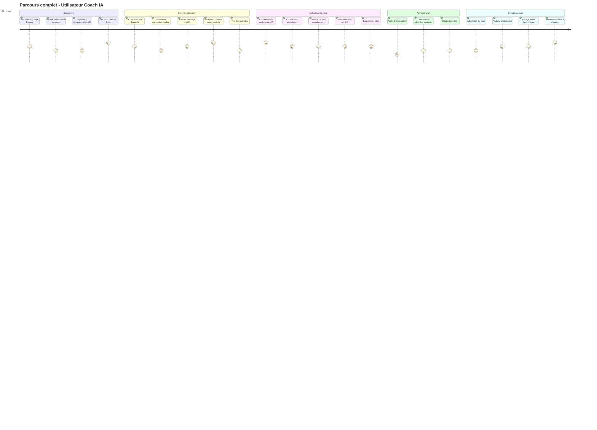
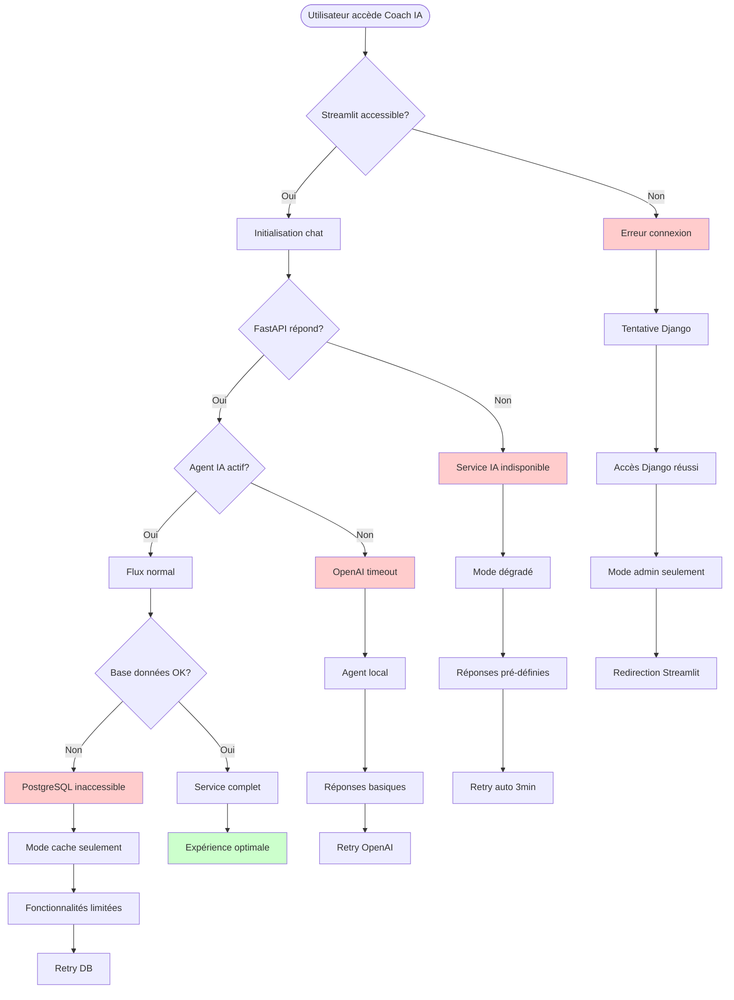
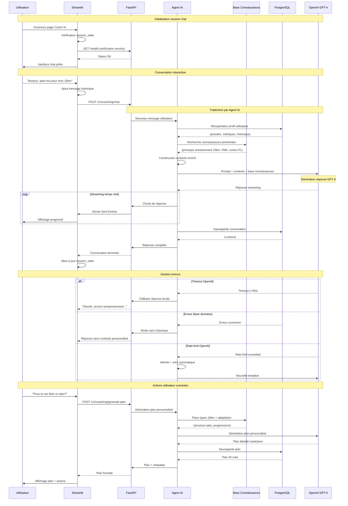
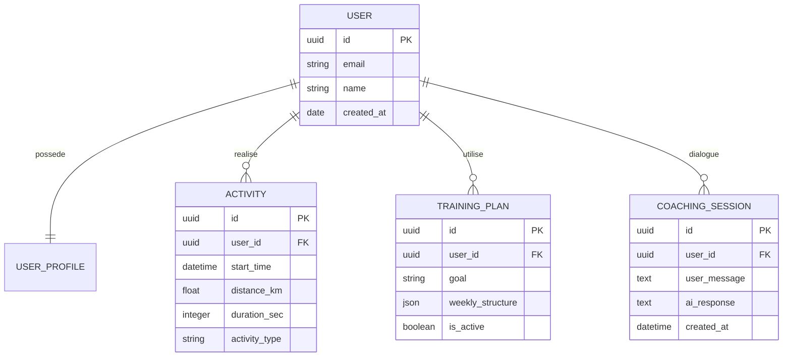
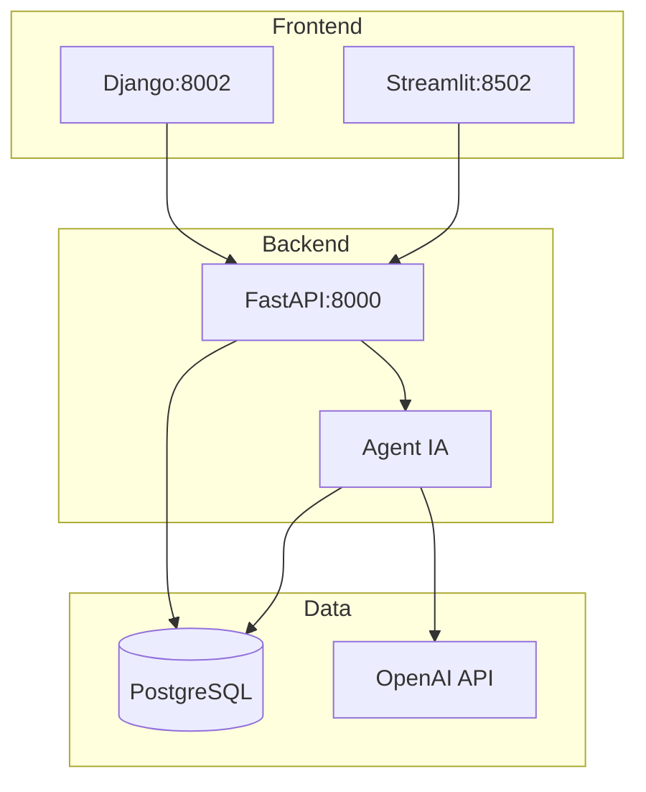
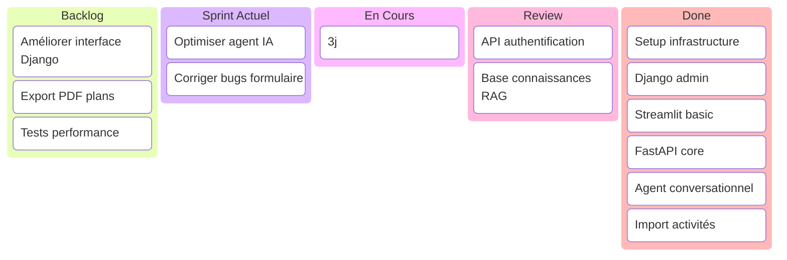

# Diagrammes Essentiels - Coach IA

## C14 - Analyse du besoin

### 1. Parcours utilisateur complet



### 1.1 Flowchart parcours alternatif - Problèmes techniques



### 1.2 Diagramme de séquence chat utilisateur/IA



### 2. Modélisation Merise essentielle



## C15 - Conception technique

### 3. Architecture technique essentielle



## C16 - Coordination agile

### 4. Kanban intermédiaire (semaine 4/8)



---

## À copier sur mermaid.live

### Diagramme C14-1 : Parcours utilisateur complet
```
journey
    title Parcours complet - Utilisateur Coach IA
    section Découverte
      Visite landing page Django: 4: User
      Lecture présentation services: 3: User
      Exploration documentation API: 3: User
      Décision d'utiliser l'app: 5: User
    section Première utilisation
      Accès interface Streamlit: 4: User
      Découverte navigation sidebar: 3: User
      Premier message chat IA: 4: User
      Réception conseils personnalisés: 5: User
      Test liste activités: 3: User
    section Utilisation régulière
      Conversations quotidiennes IA: 5: User
      Consultation statistiques: 4: User
      Génération plan entraînement: 4: User
      Validation plan généré: 4: User
      Sauvegarde plan: 4: User
    section Administration
      Accès Django admin: 2: User
      Consultation données système: 3: User
      Export données: 3: User
    section Évolution usage
      Adaptation du plan: 3: User
      Analyse progression: 4: User
      Partage retour d'expérience: 4: User
      Recommandation à d'autres: 5: User
```

### Diagramme C14-2 : Flowchart parcours alternatif
```
flowchart TD
    Start([Utilisateur accède Coach IA]) --> StreamlitCheck{Streamlit accessible?}
    
    StreamlitCheck -->|Non| Error1[Erreur connexion]
    Error1 --> Retry1[Tentative Django]
    Retry1 --> DjangoAccess[Accès Django réussi]
    DjangoAccess --> AdminOnly[Mode admin seulement]
    
    StreamlitCheck -->|Oui| ChatInit[Initialisation chat]
    ChatInit --> APICheck{FastAPI répond?}
    
    APICheck -->|Non| Error2[Service IA indisponible]
    Error2 --> FallbackMode[Mode dégradé]
    FallbackMode --> StaticResponse[Réponses pré-définies]
    
    APICheck -->|Oui| IACheck{Agent IA actif?}
    IACheck -->|Non| Error3[OpenAI timeout]
    Error3 --> LocalAgent[Agent local]
    LocalAgent --> BasicResponse[Réponses basiques]
    
    IACheck -->|Oui| NormalFlow[Flux normal]
    NormalFlow --> DBCheck{Base données OK?}
    
    DBCheck -->|Non| Error4[PostgreSQL inaccessible]
    Error4 --> CacheMode[Mode cache seulement]
    CacheMode --> LimitedFeatures[Fonctionnalités limitées]
    
    DBCheck -->|Oui| FullService[Service complet]
    FullService --> Success[Expérience optimale]
    
    style Error1 fill:#ffcccc
    style Error2 fill:#ffcccc
    style Error3 fill:#ffcccc
    style Error4 fill:#ffcccc
    style Success fill:#ccffcc
```

### Diagramme C14-3 : Séquence chat utilisateur/IA
```
sequenceDiagram
    participant U as Utilisateur
    participant ST as Streamlit
    participant FA as FastAPI
    participant AG as Agent IA
    participant OAI as OpenAI GPT-4
    
    U->>ST: "Bonjour, aide-moi pour mon 10km"
    ST->>FA: POST /v1/coaching/chat
    FA->>AG: Nouveau message
    AG->>AG: Construction contexte enrichi
    AG->>OAI: Prompt + contexte + base connaissances
    OAI-->>AG: Réponse streaming
    
    loop Streaming temps réel
        AG->>FA: Chunk de réponse
        FA->>ST: Server-Sent Events
        ST->>U: Affichage progressif
    end
    
    alt Timeout OpenAI
        OAI-->>AG: Timeout (>30s)
        AG->>FA: Fallback réponse locale
        FA-->>ST: "Service temporairement indisponible"
    end
```

### Diagramme C14-4 : Modélisation Merise
```
erDiagram
    USER ||--|| USER_PROFILE : possede
    USER ||--o{ ACTIVITY : realise
    USER ||--o{ TRAINING_PLAN : utilise
    USER ||--o{ COACHING_SESSION : dialogue
    
    USER {
        uuid id PK
        string email
        string name
        date created_at
    }
    
    ACTIVITY {
        uuid id PK
        uuid user_id FK
        datetime start_time
        float distance_km
        integer duration_sec
        string activity_type
    }
    
    TRAINING_PLAN {
        uuid id PK
        uuid user_id FK
        string goal
        json weekly_structure
        boolean is_active
    }
    
    COACHING_SESSION {
        uuid id PK
        uuid user_id FK
        text user_message
        text ai_response
        datetime created_at
    }
```

### Diagramme C15 : Architecture technique
```
graph TB
    subgraph "Frontend"
        ST[Streamlit:8502]
        DJ[Django:8002]
    end
    
    subgraph "Backend"
        FA[FastAPI:8000]
        AI[Agent IA]
    end
    
    subgraph "Data"
        PG[(PostgreSQL)]
        OAI[OpenAI API]
    end
    
    ST --> FA
    DJ --> FA
    FA --> AI
    AI --> PG
    AI --> OAI
    FA --> PG
```

### Diagramme C16 : Kanban
```
kanban
    Backlog
        Améliorer interface Django
        Export PDF plans
        Tests performance
        
    Sprint Actuel
        Optimiser agent IA
        Corriger bugs formulaire
        
    En Cours
        Chat streaming[3j]
        
    Review
        API authentification
        Base connaissances RAG
        
    Done
        Setup infrastructure
        Django admin
        Streamlit basic
        FastAPI core
        Agent conversationnel
        Import activités
```