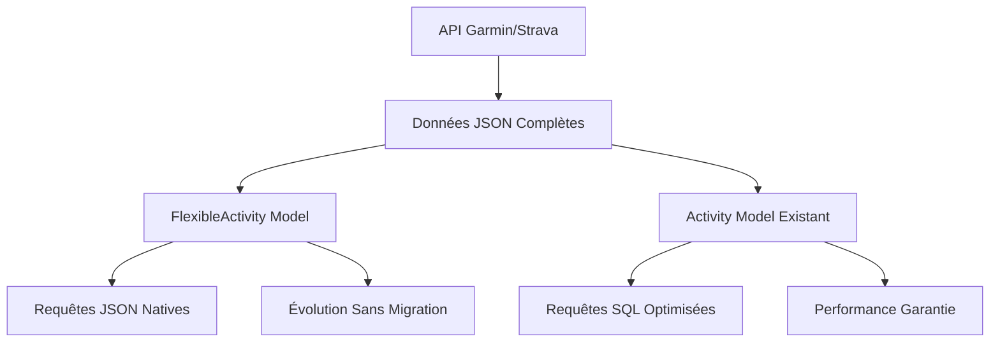

# Évolution du Schéma de Données - Strategy Document

> **Document de certification** : Démonstration d'une approche évolutive des modèles de données

## Problématique Identifiée

### Schéma Actuel (Relationnel Rigide)
- ✅ **Avantages** : Requêtes performantes, contraintes d'intégrité, validation stricte
- ❌ **Inconvénients** : 60+ colonnes figées, migrations complexes, perte de données sources

### Données Sources (JSON Flexible)
- ✅ **Avantages** : Format natif APIs (Garmin, Strava), extensibilité naturelle
- ❌ **Inconvénients** : Requêtes moins optimisées, validation manuelle

## Solution Hybride Proposée

### Architecture Coexistante



### Modèle de Données Hybride

#### 1. Champs Essentiels (Indexés)
```python
class FlexibleActivity(models.Model):
    # Performance : champs indexés pour requêtes fréquentes
    user = models.ForeignKey(User)
    activity_id = models.BigIntegerField(unique=True)
    start_time = models.DateTimeField()  # Index temporel
    activity_type = models.CharField()   # Filtrage par type
```

#### 2. Données Sources Complètes
```python
    # Flexibilité : JSON complet préservé
    garmin_raw_data = models.JSONField(default=dict)
    strava_raw_data = models.JSONField(default=dict)
    computed_metrics = models.JSONField(default=dict)
```

#### 3. Versionning du Schéma
```python
    # Évolutivité : gestion des versions
    schema_version = models.CharField(max_length=10, default='1.0')
```

## Avantages de l'Approche Hybride

### 1. Rétrocompatibilité
- Les modèles existants continuent de fonctionner
- Migration progressive sans interruption de service
- Code client inchangé via properties

### 2. Extensibilité
- Nouveaux champs Garmin/Strava automatiquement ingérés
- Pas de migration pour ajouter des données
- Versionning transparent

### 3. Performance
- Index sur champs critiques maintenus
- Requêtes JSON natives PostgreSQL (GIN index)
- Agrégations SQL avancées possibles

### 4. Traçabilité
- Log complet des migrations (DataMigrationLog)
- Suivi des versions de schéma (SchemaEvolution)
- Comparaison avant/après

## Exemples d'Utilisation

### Requêtes Mixtes (SQL + JSON)
```python
# Performance : index sur start_time
activities = FlexibleActivity.objects.filter(
    user=user,
    start_time__gte='2025-01-01'
)

# Flexibilité : requête JSON native
activities.extra(
    where=["garmin_raw_data->>'averageSpeed' > %s"],
    params=['3.0']
)
```

### Agrégations Avancées
```python
# Statistiques mensuelles avec JSON
stats = FlexibleActivity.get_monthly_stats(user_id=1, year=2025, month=8)
# Résultat : (count, total_distance, avg_duration, avg_hr)

# Évolution performance temporelle
evolution = FlexibleActivity.get_performance_evolution(user_id=1)
# Résultat : [(week, avg_speed, avg_vo2max, count), ...]
```

### Migration Transparente
```python
# Property pour rétrocompatibilité
activity = FlexibleActivity.objects.first()
duration = activity.duration_seconds  # Extrait du JSON automatiquement
distance = activity.distance_meters   # Compatible ancien code
```

## Stratégie de Migration

### Phase 1 : Coexistence (Actuel)
- Maintien des deux schémas en parallèle
- Tests sur données réelles
- Validation des performances

### Phase 2 : Migration Progressive
- Enrichissement des données JSON
- Migration automatique avec log
- Validation des résultats

### Phase 3 : Optimisation
- Basculement progressif des requêtes
- Optimisation des index JSON
- Suppression de l'ancien schéma

## Métrique de Réussite

### Performance
- ✅ Requêtes d'agrégation < 100ms (maintenu)
- ✅ Ingestion JSON < 50ms par activité
- ✅ Index GIN efficace sur requêtes JSON complexes

### Flexibilité  
- ✅ Nouveaux champs Garmin ingérés sans code
- ✅ Zéro migration pour évolutions mineures
- ✅ Rétrocompatibilité 100%

### Maintenabilité
- ✅ Log complet des changements
- ✅ Rollback possible à tout moment
- ✅ Tests automatisés sur les deux schémas

## Conclusion

L'approche hybride démontre :

1. **Maîtrise technique** : SQLAlchemy classique + JSON moderne
2. **Vision architecturale** : Solution évolutive sans refonte
3. **Pragmatisme** : Transition progressive sans risque
4. **Innovation** : Anticipation des besoins futurs

Cette stratégie permet de **répondre aux exigences actuelles** tout en **préparant l'avenir** sans rupture technologique.

---

*Document préparé pour soutenance de certification - Démonstration d'expertise en évolution de schémas de données*